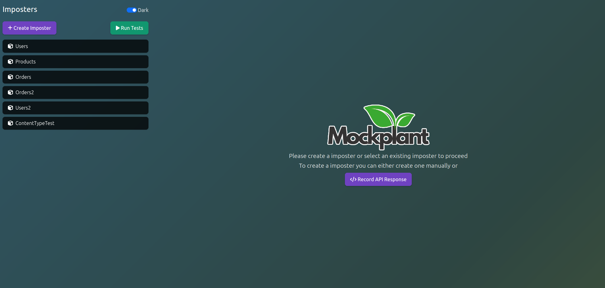
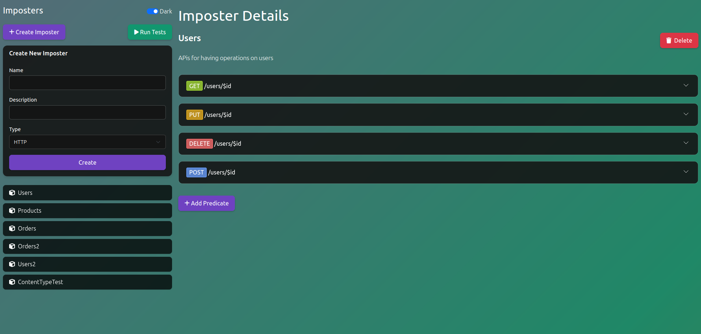

<div align="center">
  
</div>

Mockplant is a powerful API mocking tool that allows you to create and manage mock servers for testing and development purposes. It provides a user-friendly interface for creating imposters (mock endpoints) and recording API responses.

## Features

- Create and manage mock servers (imposters)
- Record real API responses and convert them to mock endpoints
- Support for various HTTP methods (GET, POST, PUT, DELETE)
- Flexible request matching with predicates
- Customizable response headers and body
- Dark/Light mode support
- Responsive design for all devices

## Prerequisites

- Python 3.8 or higher
- pip (Python package manager)
- Modern web browser

## Installation

1. Clone the repository:
```bash
git clone https://github.com/Sanyam-malik/MockPlant
cd mockplant
```

2. Create and activate a virtual environment:
```bash
python -m venv venv
source venv/bin/activate  # On Windows, use: venv\Scripts\activate
```

3. Install dependencies:
```bash
pip install -r requirements.txt
```

### Docker Installation

Alternatively, you can run Mockplant using Docker:

1. Make sure you have Docker and Docker Compose installed on your system.

2. Build and start the container:
```bash
docker-compose up -d
```

3. To stop the container:
```bash
docker-compose down
```

4. To view logs:
```bash
docker-compose logs -f
```

The container will automatically restart unless explicitly stopped.

## Usage

1. Start the server:
```bash
python mockplant_http.py
```

2. Open your web browser and navigate to:
```
http://localhost
```

> **Note:** The project comes with some example imposters in the `imposters` folder that you can use as reference or starting points for your own mock endpoints.

### Creating an Imposter

1. Click the "Create Imposter" button in the sidebar
2. Fill in the required information:
   - Name
   - Description
   - Type (HTTP)
3. Click "Create" to save the imposter

### Recording API Responses (Not Implemented Yet)

1. Click "Record API Response" on the welcome page
2. Enter the API endpoint URL
3. Configure request parameters:
   - HTTP Method
   - Headers
   - Query Parameters
   - Request Body (if needed)
4. Click "Send Request" to make the API call
5. Use "Create Imposter" to save the recorded response as a mock endpoint

## Contributing

1. Fork the repository
2. Create a new branch for your feature
3. Make your changes
4. Submit a pull request

## License

This project is licensed under the MIT License - see the LICENSE file for details.

## Acknowledgments

- Built with Flask
- Uses Bootstrap for the UI
- Font Awesome for icons 

## Screenshots

<div align="center">
  
</div>

<div align="center">
  
</div>